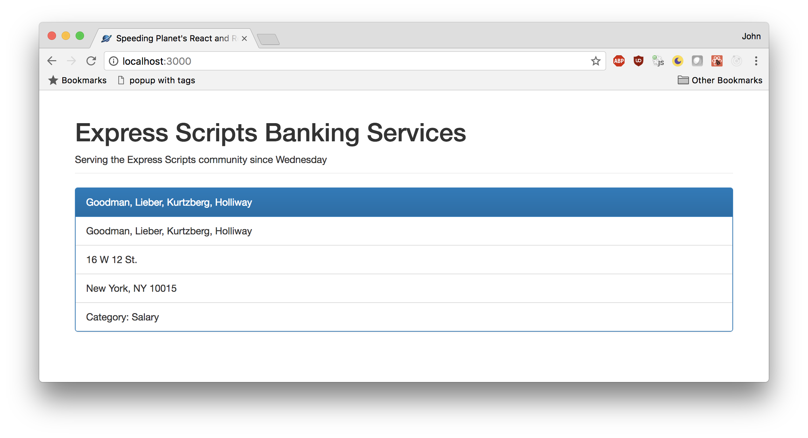

# Exercise 7 Instructions 
## Objectives
1) Build a PayeeDetail component  
2) Get a Payee (payee #23 for instance)  
3) Pass it into PayeeDetail  
4) Render out its content  
5) Write tests  

### Build a PayeeDetail component
Open `payees/PayeeDetail.tsx`.

Create a component that does the following:
* Can be a class or a function (but probably a function)
* Expects a payee as a passed property
  * You can use the Payee type, available in the **data** folder
  * Don't forget to create an interface for your props
* Renders the payee into a [Bootstrap panel](http://getbootstrap.com/components/#panels)
  * You can use the `panel-primary` class to style the panel
  * Use a `ul.list-group` with `li.list-group-item` elements to render the 
    contents of the Payee

### Get a Payee
Open `App.tsx`

Note that `class-data` is already included, so you have access to
`payeesDAO`. And Payee has been included as a type here as well. 

In the `constructor`, use `payeesDAO.get()` to retrieve a Payee and store 
it on an instance variable (i.e., assign it to `this.payee`).

### Pass it into `PayeeDetail`

Import `PayeeDetail`.  
Use `<PayeeDetail>` within the `<section>` element.
Pass `this.payee` to `PayeeDetail`.

### Render out its content

Open [http://localhost:3000/](http://localhost:3000/) in your browser to see the results.

It should look like this:


### Write tests

Open `payees/tests/PayeeDetail.spec.tsx`.  
Some of the file has been created for you.  
Fill in the tests required, specifically:

* Uncomment the line that imports `PayeeDetail`
* Configure Enzyme correctly:  

```typescript
import * as Enzyme from 'enzyme';
import * as Adapter from 'enzyme-adapter-react-16';

Enzyme.configure( { adapter: new Adapter() } );
```

* Create a snapshot test.
* Test the content of `PayeeDetail` to see if it has rendered a Payee correctly.
* Test the `props` of `PayeeDetail` to see if the reference passed in is the 
  same as the one received.
* Test to ensure that `PayeeDetail` renders a `categoryName`. This is a property of 
  a nested object, so we test it separately. 

If you didn't leave `npm test` running in a separate window, re-run it now.